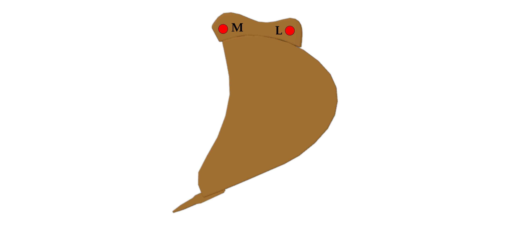

# Excavator model
This folder contains the hydraulic excavator model used in this simulator.
Below is a description of the model including references for all the material used.

## Content
The excavator model is inside the [excavator.xml](excavator.xml) file.
The 3D model of the excavator has been downloaded online[^1] and modified to fit the purpose of this simulator, as described in the next section.
The meshes are stored in the `mesh` folder.

Textures have been downloaded online ([metal][metal], [steel][steel], and [dirt][dirt]) and applied to meshes using [Blender][Blender].
The resulting textures are stored in the `texture` folder.

The `template` folder contains a template to generate an excavator model following the requested pose, given grid geometry and soil properties.
A new model can be generated using the python script `model_generation.py` located in the `script` folder.
Note that the excavator pose is calculated using the functions inside the `pose_calculation.py` file located in the `script` folder.

## Model modifications
This section lists all the modifications that have been made to the original meshes.

First, unnecessary parts, such as pipes, have been removed to produce a simpler and cleaner model.
The excavator has then been separated into its different moving parts and scaled down (100 times).

Each part has been translated such that the origin of the mesh corresponds to the location of the joint connecting it to its parent body.
The parts are then rotated so that their reference position align with the convention described in the next section.

Last, some meshes have been remeshed using [Blender][Blender] to make the texture looks more natural.

## Model geometry
The reference frame of the excavator models follow the right-hand rule and assumes that the Z axis points upward.
The different parts of the excavator are shown below.
\
\
\

\
\
\
The names of the different parts given in this schematic follows the selected convention and would be used throughouth this simulator.
Moreover, the joints connecting all the parts are also named and would be used to make the description easier.
In the following, the geometry of each part would be described.

### Caterpillar
\

\
\
\
The caterpillar is the base of the model and its origin is assumed to be at **A**.
It is connected to the chassis at **B** with a hinge joint in the **Z** direction.

Below is the Cartesian coordinates of the important points of the caterpillar in its reference position.

| Points | Coordinates   |
| ------ | ------------- |
| **A**  | (0, 0, 0)     |
| **B**  | (0, 0, 0.767) |

### Chassis
\

\
\
\
The chassis is a children of the caterpillar and its origin is assumed to be at **B**.
It is connected to the boom at **C** with a hinge joint in the **Y** direction and to the chassis piston cylinder at **D** with a hinge joint in the **Y** direction.

Below is the Cartesian coordinates of the important points of the chassis in its reference position.

| Points | Coordinates       |
| ------ | ----------------- |
| **B**  | (0, 0, 0)         |
| **C**  | (0.326, 0, 0.389) |
| **D**  | (0.800, 0, 0.152) |

### Boom
\

\
\
\
The boom is a children of the chassis and its origin is assumed to be at **C**.
It is connected to the arm at **H** with a hinge joint in the **Y** direction, to the chassis piston rod at
**E** with a hinge joint in the **Y** direction, and to the boom piston cylinder at **F** with a hinge joint in the **Y** direction.

Below is the Cartesian coordinates of the important points of the boom in its reference position.

| Points | Coordinates       |
| ------ | ----------------- |
| **C**  | (0, 0, 0)         |
| **E**  | (1.532, 0, 0.686) |
| **F**  | (2.165, 0, 0.944) |
| **H**  | (3.845, 0, 0)     |

### Chassis/Boom hydraulic piston
\

\
\
\
The chassis hydraulic piston is composed of two parts, the chassis piston cylinder and the chassis piston rod, that connects the chassis to the boom.

#### Chassis piston cylinder
The chassis piston cylinder is a children of the chassis and its origin is assumed to be at **D**.
It is connected to the chassis piston rod at **E'** with a prismatic (slide) joint in the **X** direction.
The position of **E'** is however a function of the joint state.

A possible range for the length **DE'** has been selected arbitrarily based on measurements of the mesh.

Below is the Cartesian coordinates of the important points of the chassis piston cylinder in its reference position.

| Points | Coordinates           |
| ------ | --------------------- |
| **D**  | (0, 0, 0)             |
| **E'** | (0.060 - 0.560, 0, 0) |

#### Chassis piston rod
The chassis piston rod is a children of the chassis piston cylinder and its origin is assumed to be at **E'**.
It is connected to the boom at **E** with a hinge joint in the **Y** direction.
Note that this induces a closed-loop kinematic chain.

Below is the Cartesian coordinates of the important points of the chassis piston rod in its reference position.

| Points | Coordinates   |
| ------ | ------------- |
| **E'** | (0, 0, 0)     |
| **E**  | (1.336, 0, 0) |

### Arm
\

\
\
\
The arm is a children of the boom and its origin is assumed to be at **H**.
It is connected to the bucket at **M** with a hinge joint in the **Y** direction, to the boom piston rod at
**G** with a hinge joint in the **Y** direction, to the arm piston cylinder at **I** with a hinge joint in the **Y** direction, and to the H link at **K** with a hinge joint in the **Y** direction.

Below is the Cartesian coordinates of the important points of the arm in its reference position.

| Points | Coordinates        |
| ------ | ------------------ |
| **H**  | (0, 0, 0)          |
| **G**  | (-0.551, 0, 0.147) |
| **I**  | (0.240, 0, 0.378)  |
| **K**  | (1.522, 0, 0.065   |
| **M**  | (1.996, 0, 0)      |

### Boom/Arm hydraulic piston
\

\
\
\
The boom hydraulic piston is composed of two parts, the boom piston cylinder and the boom piston rod, that connects the boom to the arm.

#### Boom piston cylinder
The boom piston cylinder is a children of the boom and its origin is assumed to be at **F**.
It is connected to the boom piston rod at **G'** with a prismatic (slide) joint in the **X** direction.
The position of **G'** is however a function of the joint state.

A possible range for the length **FG'** has been selected arbitrarily based on measurements of the mesh.

Below is the Cartesian coordinates of the important points of the boom piston cylinder in its reference position.

| Points | Coordinates           |
| ------ | --------------------- |
| **F**  | (0, 0, 0)             |
| **G'** | (0.280 - 0.930, 0, 0) |

#### Boom piston rod
The boom piston rod is a children of the boom piston cylinder and its origin is assumed to be at **G'**.
It is connected to the arm at **G** with a hinge joint in the **Y** direction.
Note that this induces a closed-loop kinematic chain.

Below is the Cartesian coordinates of the important points of the boom piston rod in its reference position.

| Points | Coordinates   |
| ------ | ------------- |
| **G'** | (0, 0, 0)     |
| **G**  | (1.147, 0, 0) |

### Bucket
\

\
\
\
The bucket is a children of the arm and its origin is assumed to be at **M**.
It is connected to the side link at **L** with a hinge joint in the **Y** direction.

Below is the Cartesian coordinates of the important points of the bucket in its reference position.

| Points | Coordinates   |
| ------ | ------------- |
| **M**  | (0, 0, 0)     |
| **L**  | (0.379, 0, 0) |

### Side link
\

\
\
\
The side link is a children of the bucket and its origin is assumed to be at **L**.
It is connected to the H link and arm piston rod at **J** with a hinge joint in the **Y** direction.
Note that this induces a closed-loop kinematic chain.

Below is the Cartesian coordinates of the important points of the side link in its reference position.

| Points | Coordinates   |
| ------ | ------------- |
| **L**  | (0, 0, 0)     |
| **J**  | (0.449, 0, 0) |

### Arm/H link hydraulic piston
\

\
\
\
The arm hydraulic piston is composed of two parts, the arm piston cylinder and the arm piston rod, that connects the arm to the H link and side link.

#### Arm piston cylinder
The arm piston cylinder is a children of the arm and its origin is assumed to be at **I**.
It is connected to the arm piston rod at **J'** with a prismatic (slide) joint in the **X** direction.
The position of **J'** is however a function of the joint state.

A possible range for the length **IJ'** has been selected arbitrarily based on measurements of the mesh.

Below is the Cartesian coordinates of the important points of the arm piston cylinder in its reference position.

| Points | Coordinates           |
| ------ | --------------------- |
| **I**  | (0, 0, 0)             |
| **J'** | (0.15 - 0.65, 0, 0) |

#### Arm piston rod
The arm piston rod is a children of the arm piston cylinder and its origin is assumed to be at **J'**.
It is connected to the H link and side link at **J** with a hinge joint in the **Y** direction.

Below is the Cartesian coordinates of the important points of the arm piston rod in its reference position.

| Points | Coordinates   |
| ------ | ------------- |
| **J'** | (0, 0, 0)     |
| **J**  | (0.866, 0, 0) |

### H link
\

\
\
\
The H link is a children of the arm piston rod and its origin is assumed to be at **J**.
It is connected to the arm at **K** with a hinge joint in the **Y** direction.
Note that this induces a closed-loop kinematic chain.

Below is the Cartesian coordinates of the important points of the H link in its reference position.

| Points | Coordinates   |
| ------ | ------------- |
| **J**  | (0, 0, 0)     |
| **K**  | (0.454, 0, 0) |

## Model pose
A typical excavator has four degrees of freedom in addition to locomotion.
Its pose can therefore be fully described by setting the state of its four active joints.
The four active joints are:

(1) The rotation of the chassis relative to the caterpillar.

(2) The boom rotation.

(3) The arm rotation.

(4) The bucket rotation.

The first active joint is straightforward to set and will not be discussed.
Other active joints are actuated by hydraulic pistons.
The state of these active joints can therefore be described using the piston extension, that is, the position of the piston rod in the piston cylinder.
It may however be difficult for the user to set the desired pose of the excavator using piston extensions.
As a result, the state of these three active joints are rather set using their angle relative to the horizontal plane, as illustrated in the schematic below.
\
\


* The boom angle is calculated as the angle of the **CH** segment relative to the horizontal plane.
* The arm angle is calculated as the angle of the **HM** segment relative to the horizontal plane.
* The bucket angle is calculated as the angle of the **ML** segment relative to the horizontal plane.

From these three input parameters, the full pose of the excavator can be calculated using simple trigonometry, as explained in the following.

Note that angles are defined as positive counter clockwise, while it is the opposite in MuJoCo.

### Boom pose
\

\
\
\
Following this schematic, the position of **E**, **F**, and **H** relative to **C** can be easily calculated
```
x_E = CE * cos(angle_boom + angle_HCE),
z_E = CE * sin(angle_boom + angle_HCE),
x_F = CF * cos(angle_boom + angle_HCF),
z_F = CF * sin(angle_boom + angle_HCF),
x_H = CH * cos(angle_boom),
z_H = CH * sin(angle_boom),
```
where **CE**, **CF**, **CH**, `angle_HCE` and `angle_HCF` are constants that can be calculated from the grid geometry (values are given in the table below).

From the **E** coordinates, it is possible to calculate the distance **ED**, and then the position of **E'** using the (constant) length **EE'** of the piston rod.
It is also possible to calculate the angle of the chassis/boom piston relative to the horizontal plane
```
angle_cb_piston = arccos((x_E - x_D) / ED).
```
Note that `arccos` is used as `angle_cb_piston` is expected to be between 0 and 180 degrees.

| Parameter   | Value | Unit |
| ----------- | ----- | ---- |
| **CH**      | 3.845 | m    |
| **CE**      | 1.678 | m    |
| **CF**      | 2.362 | m    |
| **EE'**     | 1.336 | m    |
| `angle_HCE` | 0.421 | rad  |
| `angle_HCF` | 0.411 | rad  |

### Arm pose
\

\
\
\
Following this schematic, the position of **M** relative to **H** can be easily calculated
```
x_M = HM * cos(angle_arm),
z_M = HM * sin(angle_arm),
```
where **HM** is a constant that can be calculated from the grid geometry.
Furthermore, the position of **G**, **I** and **K** relative to **H** can be calculated using the angles `alpha`, `beta` and `theta`
```
x_G = -HG * sin(alpha),
z_G = HG * cos(alpha),
x_I = HI * cos(beta),
z_I = HI * sin(beta),
x_K = HK * cos(theta),
z_K = HK * sin(theta),
```
where **HG**, **HI** and **HK** are constants that can be calculated from the grid geometry, and
```
alpha = angle_GHM + angle_arm - pi / 2,
beta = angle_GHM + angle_arm - angle_GHI,
theta = angle_GHM + angle_arm - angle_GHK,
```
with `angle_GHM`, `angle_GHI` and `angle_GHK` constants that can be calculated from the grid geometry.

From the **G** and **F** coordinates, it is possible to calculate the distance **FG**, and then the position of **G'** using the (constant) length **GG'** of the piston rod.
It is also possible to calculate the angle of the boom/arm piston relative to the horizontal plane
```
angle_ba_piston = arcsin((z_G - z_F) / FG).
```
Note that `arcsin` is used as `angle_ba_piston` is expected to be between -90 and 90 degrees.
In the excavator model, `angle_ba_piston` should be measured relative to the segment **CH**, as it is shown on the schematic above, that is the angle `angle_boom - angle_ba_piston`.

| Parameter   | Value | Unit |
| ----------- | ----- | ---- |
| **HM**      | 1.996 | m    |
| **HG**      | 0.570 | m    |
| **HI**      | 0.448 | m    |
| **HK**      | 1.523 | m    |
| **GG'**     | 1.147 | m    |
| `angle_GHM` | 2.881 | rad  |
| `angle_GHI` | 1.876 | rad  |
| `angle_GHK` | 2.838 | rad  |

### Bucket and H link pose
\

\
\
\
Following this schematic, the position of **L** relative to **M** can be easily calculated
```
x_L = LM * cos(angle_bucket),
z_L = LM * sin(angle_bucket),
```
where **LM** is a constant that can be calculated from the grid geometry.
From the **K** and **L** coordinates, it is possible to calculate the distance **KL**, which in turn gives
```
angle_JKL = arccos((JK * JK + KL * KL - JL * JL) / (2 * JK * KL)),
angle_LJK = arccos((JK * JK + JL * JL - KL * KL) / (2 * JK * JL)),
```
from the law of cosines in the **JKL** triangle, with **JK** and **JL** are constants that can be calculated from the grid geometry.

Using this, one may calculate the position of **J** relative to H
```
x_J = x_K + JK * cos(angle_JKL + alpha),
z_J = z_K + JK * sin(angle_JKL + alpha),
```
where
```
alpha = arcsin((z_L + z_M - z_K) / KL).
```
Note that `arcsin` is used as `alpha` is expected to be between -90 and 90 degrees.

From the **I** and **J** coordinates, it is possible to calculate the distance **IJ**, and then the position of **J'** using the (constant) length **JJ'** of the piston rod.
It is also possible to calculate the angle of the arm/bucket piston relative to the horizontal plane
```
angle_ah_piston = arcsin((z_J - z_I) / IJ).
```
Note that `arcsin` is used as `angle_ah_piston` is expected to be between -90 and 90 degrees.
In the excavator model, `angle_ah_piston` should be measured relative to the segment **HM**, as it is shown on the schematic above, that is the angle `angle_arm - angle_ah_piston`.

From the **L** and **J** coordinates, it is possible to calculate the angle of the side link relative to the horizontal plane
```
angle_side_link = arccos((x_J - x_M - x_L) / JL).
```
Note that `arccos` is used as `angle_side_link` is expected to be between 0 and 180 degrees.
In the excavator model, `angle_side_link` should be measured relative to the segment **ML**, as it is shown on the schematic above, that is the angle `angle_arm + angle_bucket + angle_side_link`.

Finally, it is also necessary to calculate the angle of the H link relative to the **IJ** segment
```
angle_h_link = 2 pi - angle_KJI = pi - angle_side_link + angle_ah_piston + angle_LJK.
```

| Parameter   | Value | Unit |
| ----------- | ----- | ---- |
| **JK**      | 0.454 | m    |
| **JL**      | 0.449 | m    |
| **LM**      | 0.379 | m    |
| **JJ'**     | 0.866 | m    |

## Actuation mode
The current model uses velocity control to actuate the four joints.
This is however not fully satisfactory as the boom and arm of the excavator is falling down under the influence of gravity even when a zero velocity is requested.
A custom plugin should be made to provide a better actuation.

The rotation actuator is connected to the caterpillar/chassis hinge joint, while the three other actuators are connected to the three hydraulic pistons prismatic joints.

## Inertia calculation
The inertia of the different parts have been estimated with [Meshlab][Meshlab].
Some meshes are not "watertight" and had to be modified in order to obtain an estimate.
The modifications made include:

- "Merge Close Vertices"
- "Trun into a Pure-Triangular mesh"
- "Uniform Mesh Resampling"
- "Close Holes"

In some cases, some vertices had to be deleted in order to obtain a watertight mesh.

Overall, the accuracy of the inertia estimate is expected to be low as it is assumed that all parts are composed of only one material (steel), and that [Meshlab][Meshlab] does not account for hollow meshes.
This can also be seen with the estimate of the mass of the different parts, which seems to be higher than expected.
Nevertheless, these results are reasonable at first order and are sufficient for the purpose of this simulator.

Note that the results from [Meshlab][Meshlab] were rescaled assuming a density of 8000 kg/m^3, a typical value for steel.

[Blender]: https://www.blender.org/
[Meshlab]: https://www.meshlab.net/
[metal]: https://www.poliigon.com/texture/lightly-worn-galvanised-steel-industrial-metal-texture/3129
[steel]: https://www.poliigon.com/texture/stainless-steel-texture-clean-brushed/7174
[dirt]: https://www.poliigon.com/texture/ground-dirt-weeds-patchy-004/6987

[^1]: by ipatzwijaya, https://free3d.com/3d-model/excavator-501815.html
