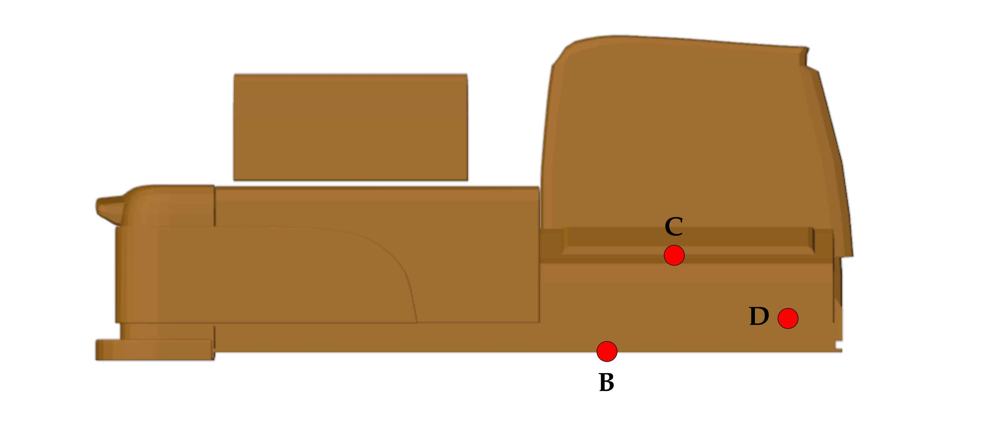
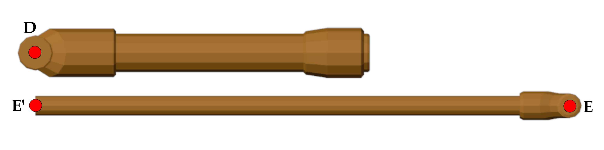

# Excavator model
This folder contains the hydraulic excavator model used in this repository.
Below is a description of the model including references for all the material used.

## Content
The excavator model is inside the `excavator.xml` file that follows MuJoCo format.
The 3D model of the excavator has been downloaded online ([3D model][]) and modified, as described in the next section, to fit the purpose of this repository.
The meshes are stored in the `mesh` folder.

Textures have been downloaded online ([metal][], [steel][], and [dirt][]) and applied to meshes using `Blender`.
The resulting textures are stored in the `texture` folder.

## Model modifications
This section lists all the modifications that have been made to the original meshes.

First, unnecessary parts, such as pipes, have been removed to produce a simpler and cleaner model.
The excavator has then been separated into its different moving parts.

Each part has been translated and rotated such that the origin of the mesh corresponds to the joint location and that the frame aligned with the chosen convention described in the next section.

Last, some meshes have been remeshed using `Blender` in order to make the texture looks more natural.

## Model geometry
The reference frame of the excavator models follows the right-hand rule and assumes that the Z axis points upward.
The different parts of the excavator are shown below.

In the following, the geometry of each part would be described.

### Caterpillar

### Chassis

### Boom

### Chassis/Boom hydraulic piston

### Arm

### Boom/Arm hydraulic piston

### Bucket

### H link

### Side link

### Arm/H link hydraulic piston

## Actuation mode
The current model uses velocity control to actuate the four joints.
This is however not fully satisfactory as the boom and arm of the excavator is falling down under the influence of gravity even when a zero velocity is requested.
A custom plugin should be made to provide a better actuation.

## Inertia calculation
The inertia of the different parts have been estimated with `Meshlab`.
Some meshes are not "watertight" and had to be modified in order to obtain an estimate.
The modifications made include:

- "Merge Close Vertices"
- "Trun into a Pure-Triangular mesh"
- "Uniform Mesh Resampling"
- "Close Holes"

In some cases, some vertices had to be deleted in order to obtain a watertight mesh.

Overall, the accuracy of the inertia estimate is expected to be low as it is assumed that all parts are composed of only one material, and that `Meshlab` does not account for hollow meshes.
This can also be seen with the estimate of the mass of the different parts, which seems to be higher than expected.
Nevertheless, these results are reasonable at first order and are sufficient for the purpose of this simulator.

Note that the results from `Meshlab` were rescaled assuming a density of 8000 kg/m^3, a typical value for steel.

[3D model]: by ipatzwijaya, https://free3d.com/3d-model/excavator-501815.html
[metal]: https://www.poliigon.com/texture/lightly-worn-galvanised-steel-industrial-metal-texture/3129
[steel]: https://www.poliigon.com/texture/stainless-steel-texture-clean-brushed/7174
[dirt]: https://www.poliigon.com/texture/ground-dirt-weeds-patchy-004/6987
